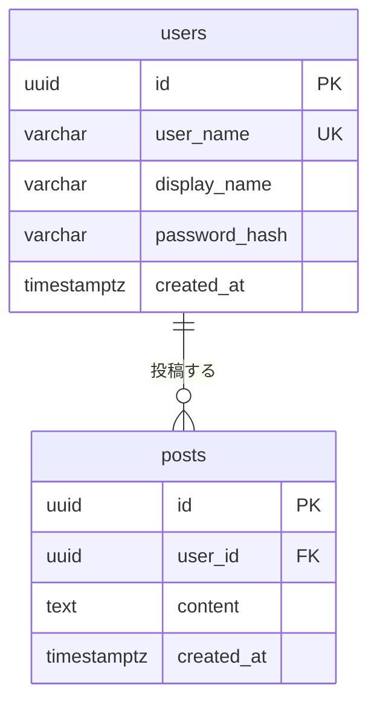

# ER図

## 概要

データベース設計です。usersテーブルでユーザー情報を、postsテーブルで投稿情報を管理します。

## ER図

## テーブル定義

### users（ユーザー）

| カラム名 | 型 | 制約 | 説明 |
|----------|-----|------|------|
| id | uuid | PRIMARY KEY | ユーザーID（UUID v4、アプリケーション側で生成） |
| user_name | varchar(50) | NOT NULL, UNIQUE | ログインID（ユニーク） |
| display_name | varchar(100) | NOT NULL | 表示名 |
| password_hash | varchar(60) | NOT NULL | ハッシュ化されたパスワード（BCrypt） |
| created_at | timestamptz | NOT NULL, DEFAULT CURRENT_TIMESTAMP | アカウント作成日時 |

#### インデックス

| インデックス名 | 対象カラム | 種類 | 説明 |
|---------------|-----------|------|------|
| idx_users_user_name | user_name | UNIQUE | ユーザー名の一意性制約とログイン時の検索高速化 |

#### 備考

- `user_name`は英数字とアンダースコアのみ許可（3〜50文字、アプリケーション層で検証）
- `display_name`は表示用の名前（1〜100文字）
- `password_hash`はBCryptでハッシュ化（ストレングス: 10以上推奨）
- `id`はアプリケーション層でUUID v4を生成

### posts（投稿）

| カラム名 | 型 | 制約 | 説明 |
|----------|-----|------|------|
| id | uuid | PRIMARY KEY | 投稿ID（UUID v4、アプリケーション側で生成） |
| user_id | uuid | NOT NULL, FOREIGN KEY REFERENCES users(id) | 投稿者のユーザーID |
| content | text | NOT NULL | 投稿本文 |
| created_at | timestamptz | NOT NULL, DEFAULT CURRENT_TIMESTAMP | 投稿日時（タイムゾーン付き） |

#### インデックス

| インデックス名 | 対象カラム | 種類 | 説明 |
|---------------|-----------|------|------|
| idx_posts_created_at_desc | created_at | DESC | 新しい順での取得を高速化 |
| idx_posts_user_id | user_id | - | ユーザーの投稿を取得する際の高速化 |

#### 備考

- `content`の文字数制限はアプリケーション層で実施（280文字）
- `id`はアプリケーション層でUUID v4を生成
- `user_id`は削除時の動作: ON DELETE CASCADE（ユーザー削除時に投稿も削除）

## 変更履歴

| 日付 | 変更内容 |
|------|----------|
| 2026-01-12 | usersテーブル追加、postsテーブルにuser_id追加（JWT認証対応） |
| 2026-01-11 | 初版作成 |
