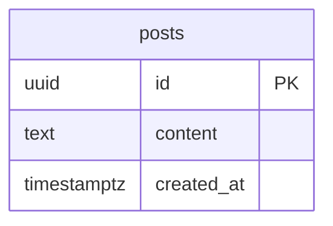

# ER図

## 概要

データベース設計です。postsテーブルで投稿情報を管理します。

## ER図

## テーブル定義

### posts（投稿）

| カラム名 | 型 | 制約 | 説明 |
|----------|-----|------|------|
| id | uuid | PRIMARY KEY, DEFAULT gen_random_uuid() | 投稿ID（UUID v4） |
| content | text | NOT NULL | 投稿本文 |
| created_at | timestamptz | NOT NULL, DEFAULT CURRENT_TIMESTAMP | 投稿日時（タイムゾーン付き） |

#### インデックス

| インデックス名 | 対象カラム | 種類 | 説明 |
|---------------|-----------|------|------|
| idx_posts_created_at_desc | created_at | DESC | 新しい順での取得を高速化 |

#### 備考

- `content`の文字数制限はアプリケーション層で実施（280文字）
- `id`はUUID v4を使用（PostgreSQLの`gen_random_uuid()`で自動生成）

## 変更履歴

| 日付 | 変更内容 |
|------|----------|
| 2026-01-11 | 初版作成 |
