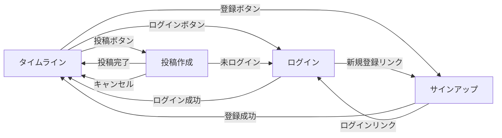

# 画面設計一覧

## 画面構成

以下の 4 画面で構成されています。

## 共通コンポーネント

| コンポーネント | 説明                               | 設計書                              |
| -------------- | ---------------------------------- | ----------------------------------- |
| ヘッダー       | 全画面共通のヘッダーコンポーネント | [header.md](./components/header.md) |

## 画面リスト

| 画面 ID     | 画面名       | パス         | 説明               | 設計書                                  |
| ----------- | ------------ | ------------ | ------------------ | --------------------------------------- |
| SC-AUTH-001 | ログイン     | `/login`     | ユーザー認証       | [login.md](./auth/login.md)             |
| SC-AUTH-002 | サインアップ | `/signup`    | 新規ユーザー登録   | [signup.md](./auth/signup.md)           |
| SC-POST-001 | タイムライン | `/`          | 投稿の一覧を表示   | [timeline.md](./post/timeline.md)       |
| SC-POST-002 | 投稿作成     | `/posts/new` | テキスト投稿を作成 | [post-create.md](./post/post-create.md) |

## 画面遷移

## 関連ドキュメント

- **API 仕様**: [open-api.yaml](../open-api.yaml) - エンドポイントとデータ構造
- **ER 図**: [er-diagram.md](../er-diagram.md) - データベース設計

## 変更履歴

| 日付       | 変更内容                                                             |
| ---------- | -------------------------------------------------------------------- |
| 2026-01-12 | ユーザー認証機能追加（ログイン、サインアップ画面）、共通ヘッダー追加 |
| 2026-01-11 | 初版作成                                                             |
