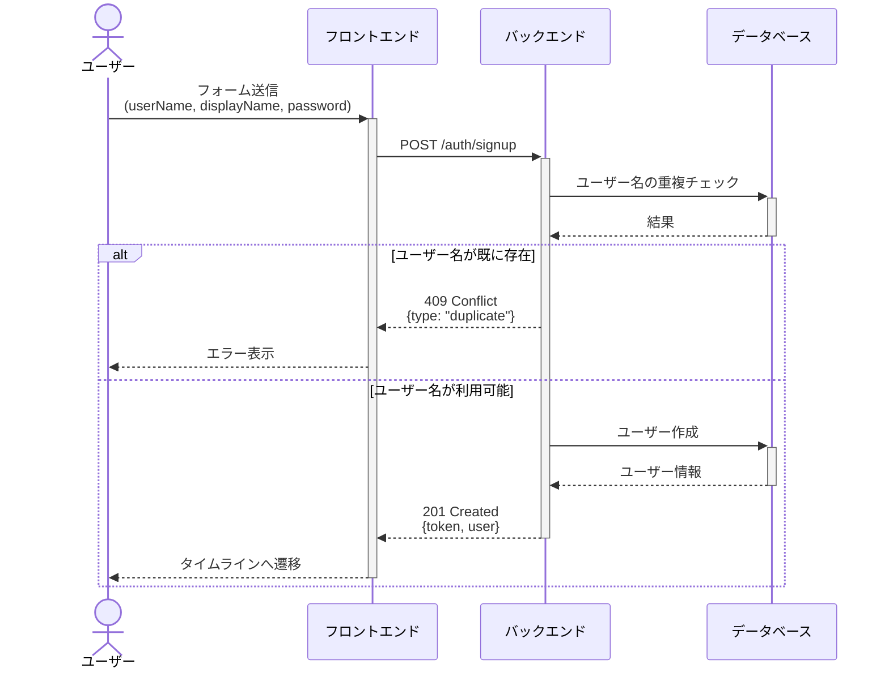
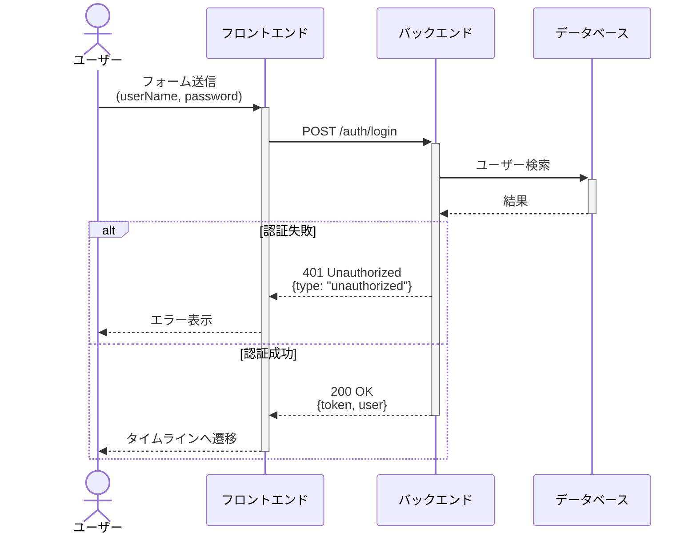
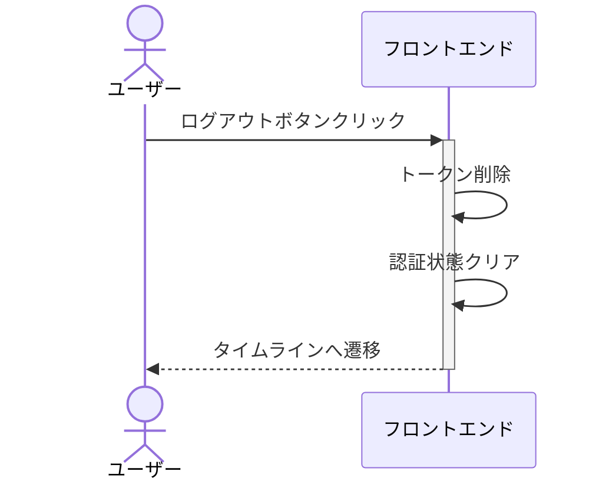
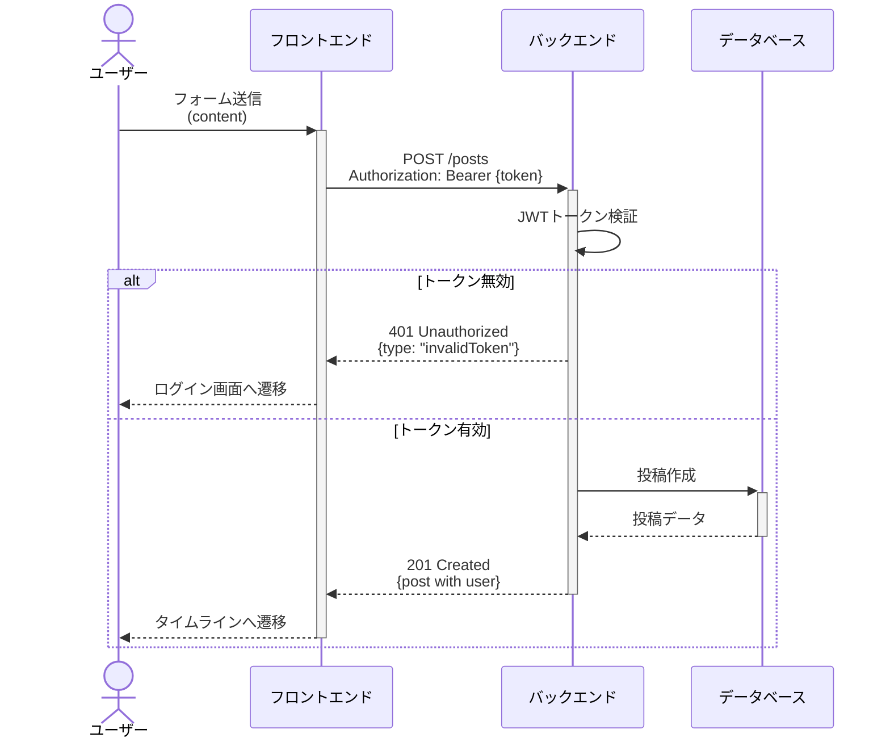

# 認証シーケンス

## 概要

JWT（JSON Web Token）を使用した認証システムの主要なシーケンス図です。フロントエンド、バックエンド、データベース間の相互作用を示します。

## サインアップ

## ログイン

## ログアウト

## 認証が必要な API（投稿作成の例）

## 備考

### トークンの扱い

- フロントエンドはトークンを保持し、認証が必要な API リクエスト時に送信する
- トークンの保存方法や管理は実装の詳細
- ログアウト時はフロントエンド側でトークンを削除する（JWT 方式のためサーバー側の処理は不要）

### JWT トークンのペイロード

- `sub` (subject): ユーザー ID（UUID）
- `iat` (issued at): 発行日時
- `exp` (expiration): 有効期限

### パスワードハッシュ化

- バックエンドは BCrypt を使用してパスワードをハッシュ化する

## 関連ドキュメント

- [ER 図](../er-diagram.md) - データベース設計
- [OpenAPI 仕様](../open-api.yaml) - API 仕様
- [画面設計](../screens/README.md) - 画面遷移

## 変更履歴

| 日付       | 変更内容                     |
| ---------- | ---------------------------- |
| 2026-01-12 | ログアウトシーケンス図を追加 |
| 2026-01-12 | 初版作成                     |
